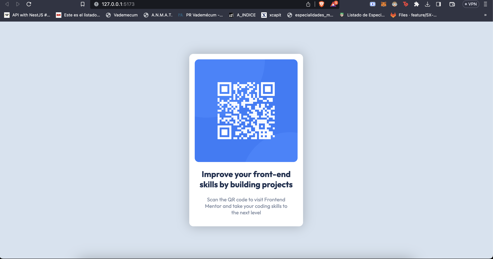
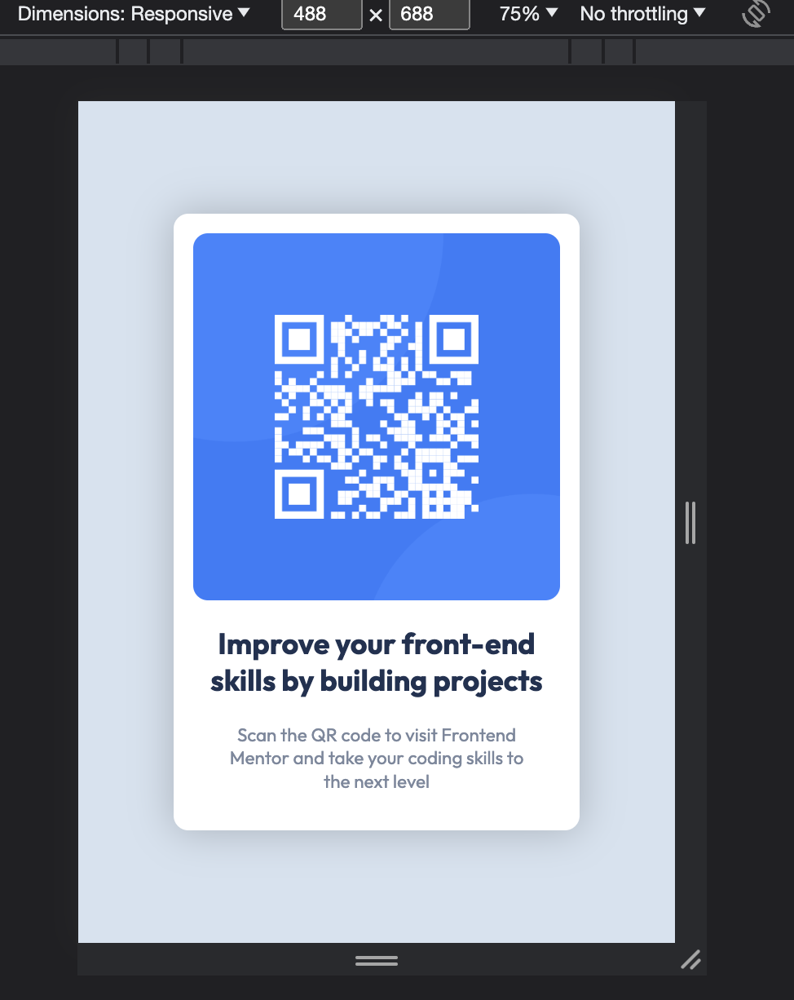

# Frontend Mentor - QR code component solution

This is a solution to the [QR code component challenge on Frontend Mentor](https://www.frontendmentor.io/challenges/qr-code-component-iux_sIO_H). Frontend Mentor challenges help you improve your coding skills by building realistic projects. 

## Table of contents

- [Overview](#overview)
  - [Screenshot](#screenshot)
  - [Links](#links)
- [Built with](#built-with)
- [Author](#author)

## Overview

### Screenshot

### Links

- Solution URL: [https://www.frontendmentor.io/solutions/qr-code-HnvlISbz3M](https://www.frontendmentor.io/solutions/qr-code-HnvlISbz3M)
- Live Site URL: [https://qr-code-matib.netlify.app/](https://qr-code-matib.netlify.app/)

## Built with

- Semantic HTML5 markup
- CSS custom properties
- Flexbox
- CSS Grid
- Mobile-first workflow
- [React](https://reactjs.org/) - JS library
- [Styled Components](https://styled-components.com/) - For styles

## Author

- Frontend Mentor - [@MatiiBr](https://www.frontendmentor.io/profile/MatiiBr)
- Twitter - [@mati_bruno97](https://twitter.com/mati_bruno97)
